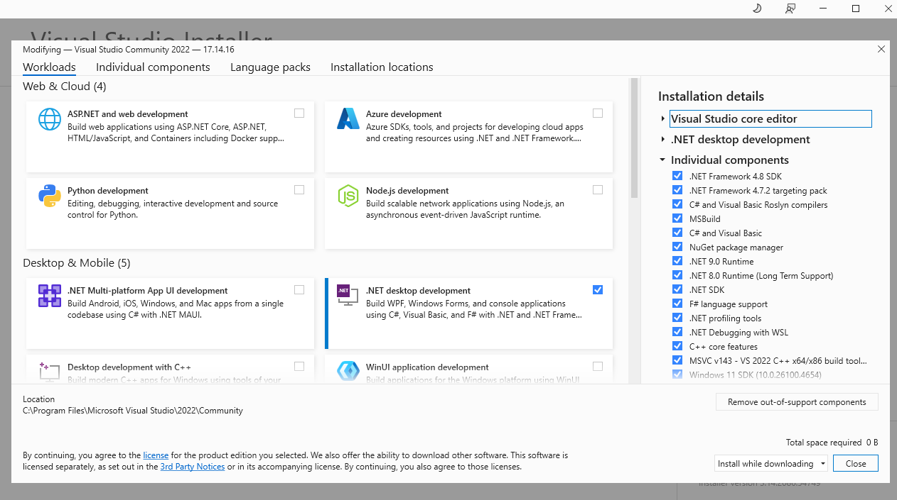
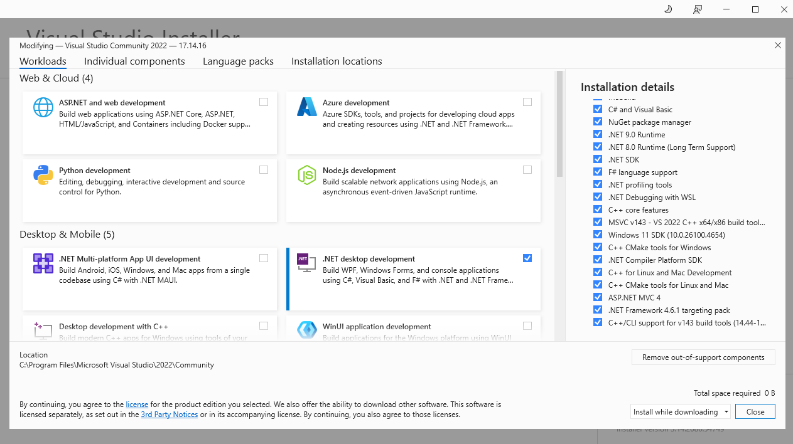

# dotnet_prep_2025

[](https://learn.microsoft.com/en-us/aspnet/core/?view=aspnetcore-9.0)
[](https://hub.docker.com/r/microsoft/mssql-server)
[](https://dotnet.microsoft.com/en-us/download/dotnet/9.0) 
[](https://visualstudio.microsoft.com/vs/community/) 
[](https://learn.microsoft.com/en-us/powershell/) 

## .NET Ecosystem 2025

1. **Application Server Pages** (**ASP**)
	* Used to build JavaScript, HTML, and CSS MVC Web apps using .NET backends.
	* Akin to Java JSP, Spring.
1. **.NET** 
	* This combines **.NET**, **.NET Core**, **.NET Framework** into one distribution (from **.NET 6** which is the "is the unification of .NET Core and the .NET Framework").
	* These include the core runtimes, build tools, and native API's for running C# apps.
	* Akin to core Java EE.
1. **Entity Framework**
	* SQL database connections.
	* Object Relation Mappings.
	* Akin to Java Entity JPA Hibernate.

### Visual Studio

**Visual Studio's** gotten much easier to configure and install over the years:
1. Open **Visual Studio Installer** and select **Modify**.
2. Key dependencies include:
   * `MSVC v143 ...`
   * `Windows 11 SDK...` (Node Gyp distributions sometimes require these)
   * `MSBuild`
   * `C# and Visual Basic`
   * `.NET 9.0 Runtime`
   * `.NET SDK`
   * `C# and Visual Basic Rosyln compilers`
   * `C++ core features`
   * `NuGet package manager`
   * `C++ CMake tools ...`
   * `C++/CLI support v143 build tools...`
   * etc.
3. Depicted:
   * 
   *   
4. Not installing those may cause issues with various tools/dependencies from outside C# and Dotnet depending on various 3rd-party installation configurations:
   * C++
   * Git CLI 
   * Python
   * Node
   * Node-Gyp

#### Key Commands

1. Obtain a PowerShell Terminal: 
	* **View** > **Terminal**
2. Main View I like to use: 
	* **View** > **Solution Explorer**

#### Use

The steps in the section below will setup and configure a new **Solution** from scratch.
1. One can open and navigate to the **Solution** file (`.sln`).
1. Then **Build** and **Run** the **Solution** from within **Visual Studio 2022**.

### CLI Commands

From within **Visual Studio** (using the steps above):

```shell
# Version
dotnet --version 
## 9.0.305

# Create new Solution File
## Don't append an extra .sln here 
## it will cause the Solution to break
dotnet new sln --name mysolution

# Create new project
cd src
dotnet new console --language "C#"
## This creates a Terminal Console app 
## that will open a Window when built and run

# Add Project to Solution
cd ../
dotnet sln add src
```

## Language Overview

### Vs. Java

### Key Concepts

1. `Program.cs` is the default **Main Method** file and entrypoint for `Console` **Project**. 
	* This will be created - expect it.
	* It doesn't have to have a **Class** definition.

## Resources and Links

1. https://zerotomastery.io/blog/dot-NET-interview-questions/
1. https://beetroot.co/team/18-interview-questions-to-ask-a-senior-net-developer/
1. https://www.c-sharpcorner.com/article/net-ecosystem/

### Code Samples

1. https://github.com/Thoughtscript/dotnet_2025/tree/main/csharp/src